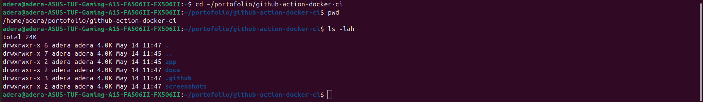
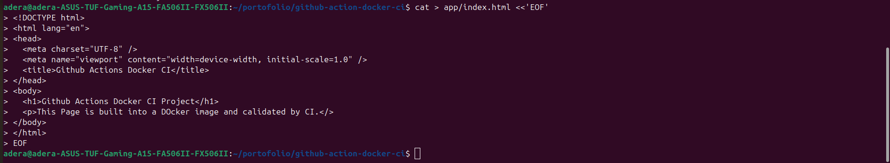
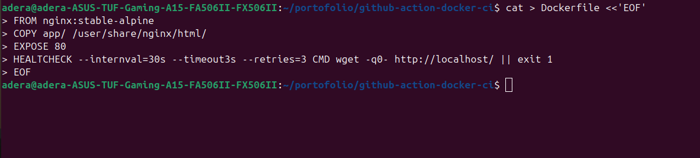
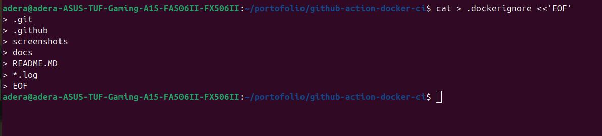
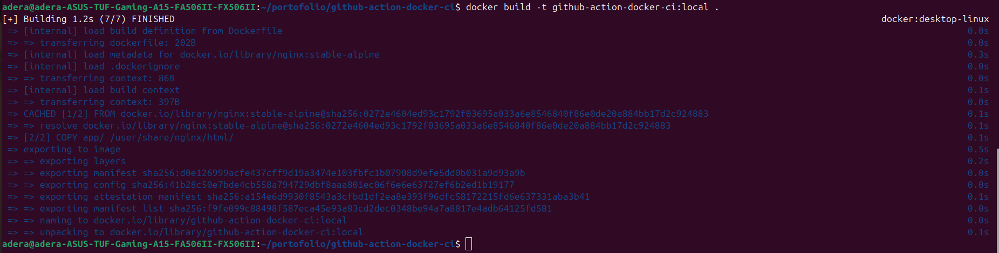
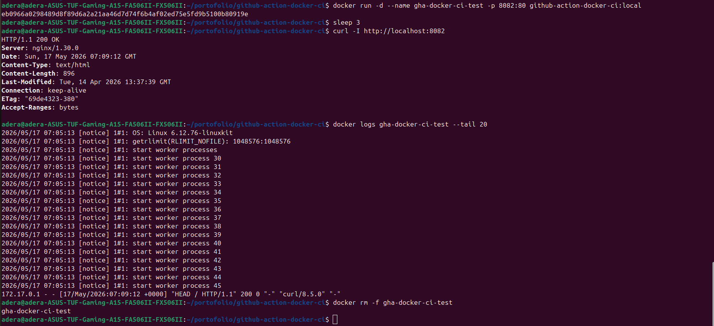
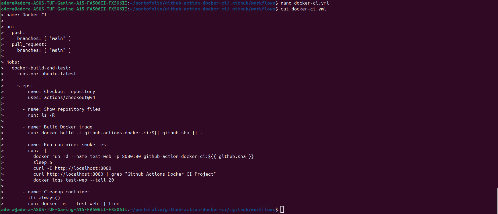
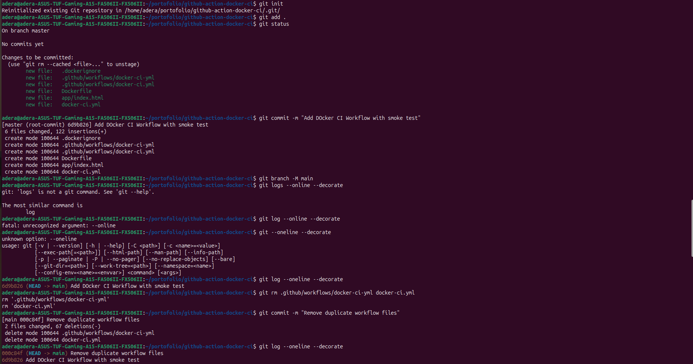
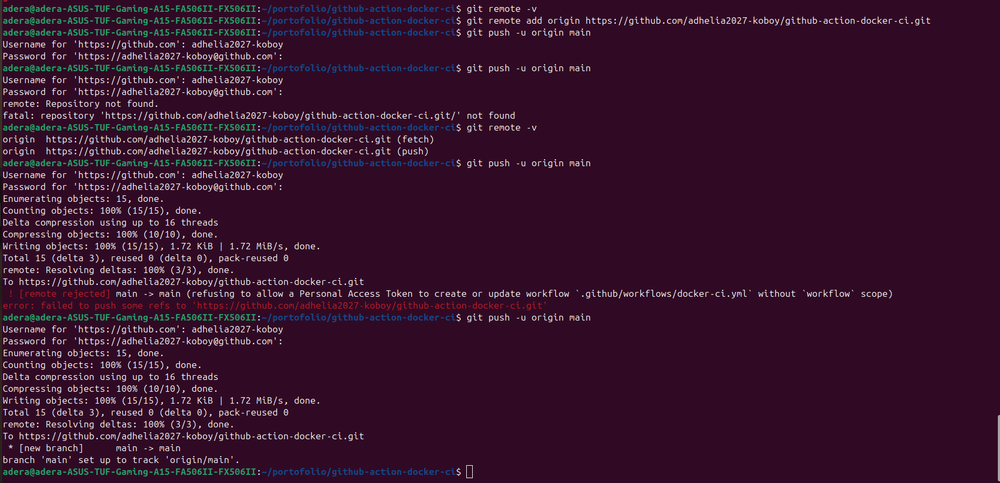
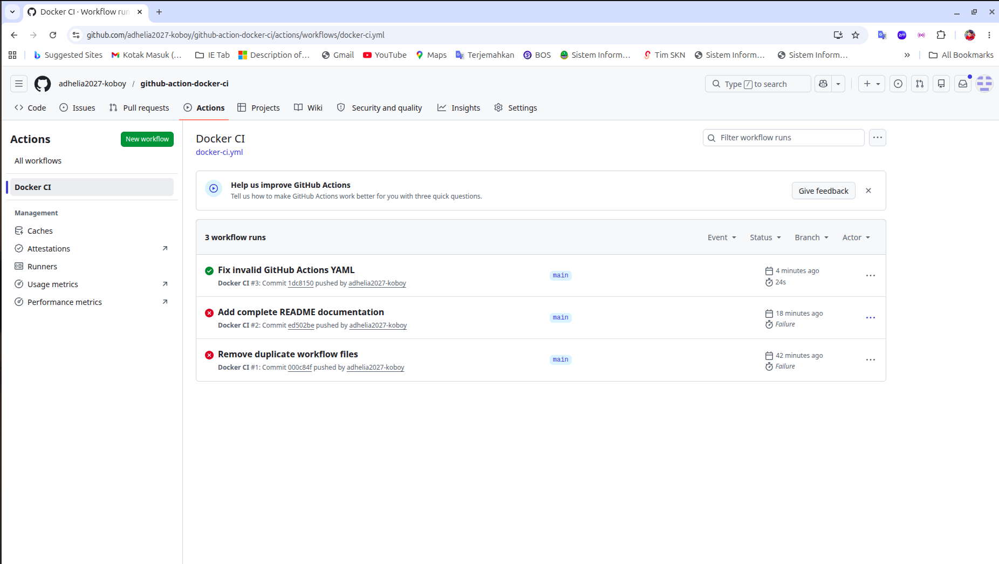

# Docker CI Pipeline with GitHub Actions

## Project Overview

This project demonstrates a simple Docker-based Continuous Integration (CI) pipeline using GitHub Actions.

The application is a static web page served by Nginx inside a Docker container. Every time code is pushed to the `main` branch, GitHub Actions automatically builds the Docker image, runs the container, performs a basic smoke test using `curl`, and removes the test container after the job is finished.

This project is designed as a Cloud Engineer / DevOps portfolio project to demonstrate basic containerization, Git workflow, and CI automation skills.

---

## Problem

In a real development environment, Docker images need to be tested before they are deployed.

If testing is done manually, several problems can happen:

- Developers may forget to test the Docker image.
- Dockerfile errors may be found too late.
- The application may build successfully but fail when running inside a container.
- There may be no automatic validation before code is pushed or merged.
- Manual testing can be inconsistent between different developers or environments.

---

## Solution

This project solves the problem by using GitHub Actions as an automated CI pipeline.

The CI pipeline automatically:

1. Checks out the repository source code.
2. Builds a Docker image from the Dockerfile.
3. Runs the Docker image as a container.
4. Tests whether the web application responds through HTTP.
5. Shows container logs for debugging.
6. Removes the test container after the job is completed.

This helps ensure that every new change can still be built and run successfully as a Docker container.

---

## Tools and Technologies Used

- Docker
- Dockerfile
- Nginx
- Git
- GitHub
- GitHub Actions
- Linux / WSL Ubuntu
- curl

---

## Project Structure

```text
github-action-docker-ci/
├── app/
│   └── index.html
├── .github/
│   └── workflows/
│       └── docker-ci.yml
├── .dockerignore
├── Dockerfile
└── README.md
```

---

## Application

The application is a simple static website located inside the `app/` directory.

The file:

```text
app/index.html
```

is copied into the default Nginx web root directory inside the container:

```text
/usr/share/nginx/html/
```

When the container runs, Nginx serves the web page through port `80`.

---

## Dockerfile

The Dockerfile is used to build the Docker image for this project.

```dockerfile
FROM nginx:stable-alpine

COPY app/ /usr/share/nginx/html/

EXPOSE 80

HEALTHCHECK --interval=30s --timeout=3s --retries=3 CMD wget -qO- http://localhost/ || exit 1
```

---

## Dockerfile Explanation

### `FROM nginx:stable-alpine`

This line uses the official Nginx image as the base image.

The `stable-alpine` version is used because it is smaller and lighter than a full Linux-based image.

### `COPY app/ /usr/share/nginx/html/`

This line copies all files from the local `app/` directory into the default Nginx web directory inside the container.

Nginx will serve files from:

```text
/usr/share/nginx/html/
```

### `EXPOSE 80`

This line documents that the container listens on port `80`.

It does not publish the port to the host machine by itself. The port is published when running the container using the `-p` option.

Example:

```bash
docker run -p 8082:80 image-name
```

This maps:

```text
Host port 8082 -> Container port 80
```

### `HEALTHCHECK`

The health check is used to verify whether the web server inside the container is responding.

```dockerfile
HEALTHCHECK --interval=30s --timeout=3s --retries=3 CMD wget -qO- http://localhost/ || exit 1
```

Explanation:

- `--interval=30s` means Docker checks the container every 30 seconds.
- `--timeout=3s` means the check fails if there is no response within 3 seconds.
- `--retries=3` means Docker marks the container as unhealthy after 3 failed checks.
- `wget -qO- http://localhost/` checks whether the Nginx web server responds.
- `|| exit 1` returns a failure status if the check fails.

---

## Build the Docker Image Locally

To build the Docker image locally, run:

```bash
docker build -t github-action-docker-ci:local .
```

Explanation:

- `docker build` builds a Docker image.
- `-t github-action-docker-ci:local` gives the image a name and tag.
- `.` means Docker uses the current folder as the build context.

---

## Run the Container Locally

To run the container locally, use:

```bash
docker run -d --name gha-docker-ci-test -p 8082:80 github-action-docker-ci:local
```

Explanation:

- `docker run` creates and starts a container.
- `-d` runs the container in the background.
- `--name gha-docker-ci-test` gives the container a readable name.
- `-p 8082:80` maps port `8082` on the host to port `80` inside the container.
- `github-action-docker-ci:local` is the Docker image name.

---

## Test the Container Locally

After running the container, test it using:

```bash
curl -I http://localhost:8082
```

This checks the HTTP response header.

You can also check the web page content:

```bash
curl http://localhost:8082
```

Or open it in a browser:

```text
http://localhost:8082
```

---

## Stop and Remove the Container

To remove the test container, run:

```bash
docker rm -f gha-docker-ci-test
```

Explanation:

- `docker rm` removes a container.
- `-f` forces the container to stop and be removed.

---

## GitHub Actions Workflow

The GitHub Actions workflow file is located at:

```text
.github/workflows/docker-ci.yml
```

The workflow runs automatically when code is pushed to the `main` branch or when a pull request is opened against the `main` branch.

---

## GitHub Actions Workflow File

```yaml
name: Docker CI

on:
  push:
    branches: [ "main" ]
  pull_request:
    branches: [ "main" ]

jobs:
  docker-build-and-test:
    runs-on: ubuntu-latest

    steps:
      - name: Checkout repository
        uses: actions/checkout@v4

      - name: Show repository files
        run: ls -R

      - name: Build Docker image
        run: docker build -t github-action-docker-ci:${{ github.sha }} .

      - name: Run container smoke test
        run: |
          docker run -d --name test-web -p 8080:80 github-action-docker-ci:${{ github.sha }}
          sleep 5
          curl -I http://localhost:8080
          curl -f http://localhost:8080
          docker logs test-web --tail 20

      - name: Cleanup container
        if: always()
        run: docker rm -f test-web || true
```

---

## CI Pipeline Flow

```text
Developer pushes code to GitHub
        ↓
GitHub Actions starts automatically
        ↓
Repository is checked out
        ↓
Docker image is built
        ↓
Docker container is started
        ↓
Smoke test is executed using curl
        ↓
Container logs are displayed
        ↓
Test container is removed
```

---

## Smoke Test

A smoke test is a basic test used to check whether the main function of an application works.

In this project, the smoke test checks whether the Nginx web server responds through HTTP.

The test command is:

```bash
curl -f http://localhost:8080
```

If the website responds successfully, the pipeline continues.

If the website does not respond, the pipeline fails.

---

## Expected Result

When the CI pipeline succeeds, it proves that:

- The Dockerfile syntax is valid.
- The Docker image can be built successfully.
- The container can start successfully.
- The web application can respond through HTTP.
- The container can be tested automatically.
- The project has a basic CI validation process.

---

## Common Issues and Troubleshooting

### 1. Docker image not found locally

Error example:

```text
Unable to find image 'github-action-docker-ci:local' locally
```

Cause:

The Docker image has not been built yet.

Solution:

```bash
docker build -t github-action-docker-ci:local .
```

---

### 2. Dockerfile typo

Error example:

```text
unknown instruction: HEALTCHECK
```

Cause:

The correct Dockerfile instruction is:

```dockerfile
HEALTHCHECK
```

not:

```dockerfile
HEALTCHECK
```

---

### 3. Wrong Nginx directory

Incorrect path:

```text
/user/share/nginx/html/
```

Correct path:

```text
/usr/share/nginx/html/
```

The correct Nginx web root directory is:

```text
/usr/share/nginx/html/
```

---

### 4. Wrong wget option

Incorrect:

```bash
wget -q0-
```

Correct:

```bash
wget -qO-
```

The correct option uses the uppercase letter `O`, not the number zero.

---

### 5. GitHub token workflow scope error

Error example:

```text
refusing to allow a Personal Access Token to create or update workflow without workflow scope
```

Cause:

The GitHub Personal Access Token does not have permission to create or update GitHub Actions workflow files.

Solution:

Create a new GitHub Personal Access Token with the required permissions:

- `repo`
- `workflow`

Then push again.

---

## Commands Summary

### Build image

```bash
docker build -t github-action-docker-ci:local .
```

### Run container

```bash
docker run -d --name gha-docker-ci-test -p 8082:80 github-action-docker-ci:local
```

### Test container

```bash
curl -I http://localhost:8082
curl http://localhost:8082
```

### Remove container

```bash
docker rm -f gha-docker-ci-test
```

### Check Git status

```bash
git status
```

### Add changes

```bash
git add .
```

### Commit changes

```bash
git commit -m "Add complete README documentation"
```

### Push changes

```bash
git push
```

---

## Project Evidence / Screenshots

This section contains screenshots that document the project implementation process from local setup, Docker build, container testing, Git workflow, and GitHub Actions CI result.

### 1. Project Folder Created

This screenshot shows the initial project folder structure.



---

### 2. Static Website File Created

This screenshot shows the `index.html` file inside the `app/` directory.



---

### 3. Dockerfile Created

This screenshot shows the Dockerfile used to build the Nginx-based Docker image.



---

### 4. Docker Ignore File Created

This screenshot shows the `.dockerignore` file used to exclude unnecessary files from the Docker build context.



---

### 5. Local Docker Build Success

This screenshot shows the Docker image successfully built on the local machine.



---

### 6. Local Container Smoke Test

This screenshot shows the container running locally and being tested using HTTP request.



---

### 7. GitHub Actions Workflow Created

This screenshot shows the GitHub Actions workflow file used for Docker CI automation.



---

### 8. Git Commit on Main Branch

This screenshot shows the project files committed into the `main` branch.



---

### 9. Git Push to GitHub

This screenshot shows the local repository successfully pushed to GitHub.



---

### 10. GitHub Actions Success

This screenshot shows the GitHub Actions workflow completed successfully.



---

## Portfolio Value

This project demonstrates several important Cloud Engineer and DevOps skills:

- Writing a Dockerfile
- Building Docker images
- Running Docker containers
- Testing containers locally
- Creating a GitHub Actions CI workflow
- Running automated smoke tests
- Managing source code with Git and GitHub
- Debugging Docker and CI pipeline errors
- Understanding the basic CI process before deployment

---

## Current Limitation

This project only performs CI testing.

It does not yet:

- Push the Docker image to Docker Hub
- Deploy the container to a cloud server
- Deploy to Kubernetes
- Use Terraform
- Use production monitoring

These features can be added in future improvements.

---

## Future Improvements

Possible future improvements:

- Push Docker image to Docker Hub or GitHub Container Registry
- Add Docker image vulnerability scanning
- Deploy the application to AWS EC2
- Deploy the application to Kubernetes
- Add Terraform for infrastructure provisioning
- Add monitoring and logging
- Add automated rollback strategy
- Add branch protection rules
- Add pull request validation

---

## What I Learned

From this project, I learned how to:

- Create a Dockerfile for a static Nginx website.
- Build and run a Docker image locally.
- Debug Dockerfile syntax errors.
- Understand the difference between Docker image and Docker container.
- Create a GitHub Actions workflow.
- Run automated CI checks after pushing code.
- Use `curl` as a basic smoke test.
- Push a local Git repository to GitHub.
- Troubleshoot GitHub token permission issues.

---

## Author

Ade Rahmat Taufik

Cloud Engineer Learner

GitHub: adhelia2027-koboy
